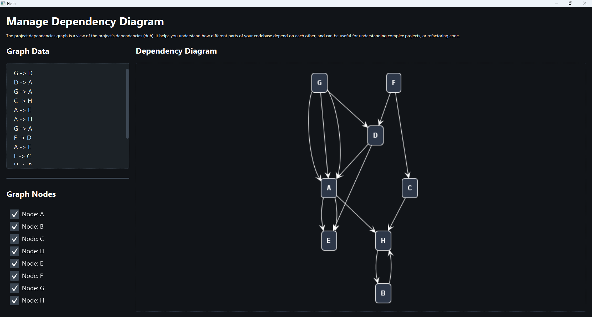

# Dependency Diagram

A GUI application written in Kotlin that helps you visualize and interact with directed graphs, particularly useful for understanding dependencies in projects.



## Overview

The project dependencies graph is a view of your project's dependencies. It helps you understand how different parts of your codebase depend on each other and can be useful for understanding complex projects or refactoring code.

## Features

- **Graph Input Area**: Simple text box where you can define directed graph edges using a simple syntax (`A -> B`)
- **Dependency Visualization**: Automatically generated diagram that updates as you modify the graph definition
- **Interactive Vertex List**: Enable or disable specific vertices to focus on particular sections of your dependency graph
- **Responsive UI**: The application remains responsive even when working with larger graphs

## Getting Started

### Prerequisites

- Java Runtime Environment (JRE) 8 or higher

### Installation

1. Clone this repository:
   ```
   git clone https://github.com/arezinam/dependency-diagram.git
   ```

2. Navigate to the program folder which contains the executable JAR file:
   ```
   cd dependency-diagram/program
   ```

3. Run the application:
   ```
   java -jar DependencyDiagram.jar
   ```

## Usage

1. **Define Your Graph**: In the left panel labeled "Graph Data", add your dependencies one per line using the syntax `SourceNode -> TargetNode`
2. **View the Diagram**: The dependency graph will automatically render in the right panel
3. **Toggle Nodes**: Use the checkboxes in the "Graph Nodes" section to show/hide specific nodes

Example graph definition:
```
G -> D
D -> A
G -> A
C -> H
A -> E
A -> H
G -> A
F -> D
A -> E
F -> C
H -> B
```


## Acknowledgments

- This project was developed as part of a programming task for demonstrating directed graph visualization capabilities.
- The visualization is powered by PlantUML library.
